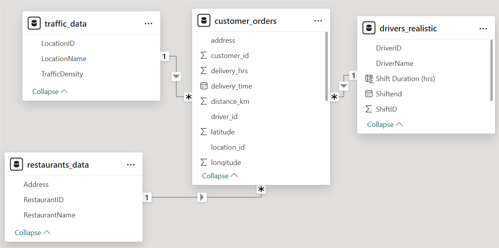
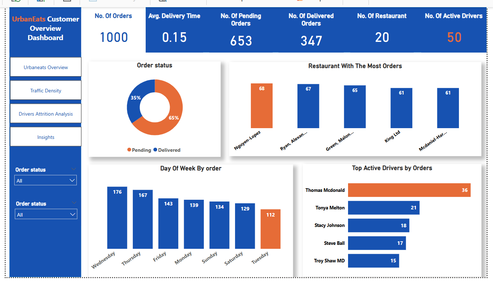
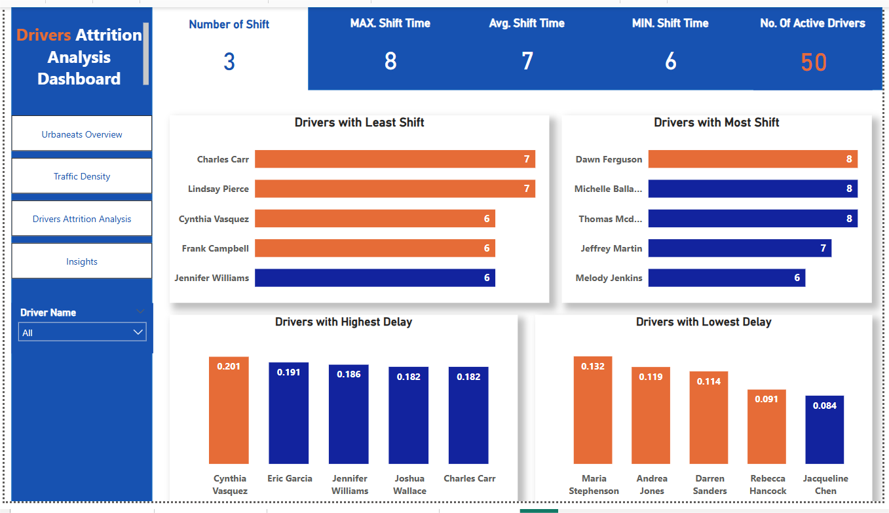
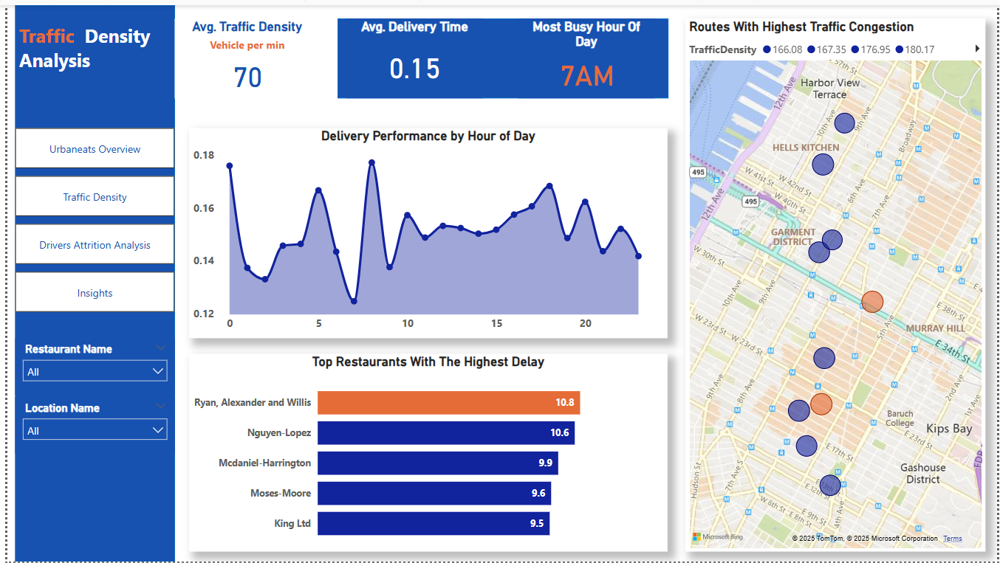

# UrbanEats Route Optimization Analysis

## Background and Overview
### Project Context:

UrbanEats is a leading food delivery company operating in densely populated urban areas across multiple cities. The company faces critical operational challenges including prolonged delivery times, escalating operational costs, inaccurate delivery estimates, and high driver attrition rates. This analysis examines delivery patterns, traffic impacts, and driver performance to identify optimization opportunities.

### Business Objectives:

- Reduce delivery times by minimum 20% in dense urban areas
- Decrease operational costs by 15% through efficient routing strategies
- Improve driver satisfaction and retention rates
- Enhance overall customer delivery experience

#### Analysis Focus Areas:

- Delivery performance analysis across time periods and locations
- Traffic density impact on delivery efficiency
- Driver workload distribution and shift optimization
- Restaurant performance evaluation
- Peak demand pattern identification

### Data Structure Overview
The analysis utilizes four interconnected datasets representing the complete delivery ecosystem:

# Database Schema

## Table 1: Customer Orders

| Column Name     | Key           | Data Type | Description                                                                 |
|-----------------|--------------|-----------|-----------------------------------------------------------------------------|
| OrderID         | Primary Key  | Integer   | A unique identifier for each customer order.                                |
| CustomerID      | Foreign Key  | Integer   | References `CustomerID` in the **Customers** table.                         |
| DeliveryAddress |              | Text      | The precise address where the food delivery is to be made.                  |
| Latitude        |              | Decimal   | Geographical latitude of the delivery address. Units: Degrees (°).          |
| Longitude       |              | Decimal   | Geographical longitude of the delivery address. Units: Degrees (°).         |
| OrderTimestamp  |              | DateTime  | Date and time when the order was placed. Format: YYYY-MM-DD HH:MM:SS.       |
| OrderStatus     |              | Text      | The current status of the order.                                            |
| DriverID        | Foreign Key  | Integer   | References `DriverID` in the **Drivers** table.                             |
| RestaurantID    | Foreign Key  | Integer   | References `RestaurantID` in the **Restaurants** table.                     |

---

## Table 2: Traffic Data

| Column Name    | Key          | Data Type | Description                                                |
|----------------|-------------|-----------|------------------------------------------------------------|
| LocationID     | Primary Key | Integer   | A unique identifier for each urban location.               |
| LocationName   |             | Text      | A descriptive name for the urban location.                 |
| TrafficDensity |             | Decimal   | Traffic congestion or density. Units: Vehicles per Minute. |

---

## Table 3: Drivers

| Column Name | Key          | Data Type | Description                                                           |
|-------------|-------------|-----------|-----------------------------------------------------------------------|
| DriverID    | Primary Key | Integer   | A unique identifier for each driver.                                  |
| DriverName  |             | Text      | The name of the driver.                                               |
| ShiftID     |             | Integer   | An identifier for the driver's shift.                                 |
| ShiftStart  |             | DateTime  | Start time of the driver's shift. Format: YYYY-MM-DD HH:MM:SS.        |
| ShiftEnd    |             | DateTime  | End time of the driver's shift. Format: YYYY-MM-DD HH:MM:SS.          |

---

## Table 4: Restaurants

| Column Name    | Key          | Data Type | Description                                |
|----------------|-------------|-----------|--------------------------------------------|
| RestaurantID   | Primary Key | Integer   | A unique identifier for each restaurant.   |
| RestaurantName |             | Text      | The name of the restaurant.                |
| Address        |             | Text      | The restaurant's address.                  |

[View SQL Codes Used For the Analysis](UrbanEatsSql/UrbanEatsSql.sql)

[View Interactive PowerBI Dashboard and DAX Calculated](UrbanEats_Analysis/UrbanEats_Analysis.pbix)

### Tools Used:

- **MySQL:** Data storage, transformation, and analysis
- **Power BI:** Interactive dashboards and geographic visualization
- **DAX:** Advanced calculated measures for performance metrics

#### Key Metrics Developed:

- Dynamic delivery time calculations accounting for traffic density
- Driver efficiency scoring across shift patterns
- Restaurant performance indexing
- Peak demand forecasting indicators

## Executive Summary

### Key Performance Metrics:

- **Average delivery time:** 9 minutes (0.15 hours)
- **Order completion rate:** 35% delivered, 65% pending
- **Average traffic density:** 70 vehicles per minute
- **Driver utilization:** 50 active drivers across 3 shift patterns

#### Critical Findings:

- **Delivery Performance:** The company maintains consistent delivery performance with an average of **9 minutes per delivery**. However, with **65%** of orders still pending, there's a significant backlog indicating capacity constraints or routing inefficiencies.

- **Traffic Impact:** Traffic density varies dramatically **(range: 2-194 vehicles/minute)**, directly correlating with delivery times. Peak congestion occurs during **morning hours (7 AM)**, suggesting the need for dynamic routing algorithms that account for real-time traffic conditions.

- **Operational Bottlenecks:** Restaurant performance analysis reveals significant variations in preparation times, with some locations showing consistently higher delays. Top-performing restaurants handle **61-68 orders** efficiently, while underperforming locations create delivery cascading delays.

### Insights Deep Dive

#### Peak Demand Analysis

- **Finding:** **Wednesday and Thursday** show the highest order volumes **(176 and 167 orders respectively)**, with **7 AM** identified as the most busy hour of the day.

- **Business Impact:** This concentration of demand during specific time windows creates resource allocation challenges. The morning peak at **7 AM** suggests breakfast delivery demand that may require dedicated driver scheduling and restaurant partnerships optimized for quick morning preparation.

#### Driver Performance Patterns

- **Finding:** Driver **Thomas McDonald handles 36 orders (highest volume)**, while shift lengths remain standardized at **6-8 hours**. However, performance analysis reveals delivery time variations ranging from 0.084 to 0.201 hours across different drivers.

- **Business Impact:** The 2.4x performance difference between top and bottom performers indicates significant opportunity for driver training, route optimization, or performance-based incentives. High-performing drivers like **Jacqueline Chen (0.084 hour average)** demonstrate achievable efficiency benchmarks.

#### Geographic Performance Variations

- **Finding:** Traffic density analysis reveals location-specific challenges with some areas experiencing up to **194 vehicles per minute** during peak periods, while others maintain lower congestion **(under 10 vehicles per minute)**.

- **Business Impact:** The geographic visualization identifies specific high-congestion zones requiring alternative routing strategies. Areas with consistent high traffic density should be prioritized for dedicated delivery hubs or partnership with local micro-fulfillment centers.

#### Restaurant Efficiency Analysis

- **Finding:** Restaurant performance varies significantly, with **Ryan, Alexander and Willis** showing the **highest delays (10.8 minute average)**, while **Nguyen-Lopez (68 orders)** demonstrates high volume with reasonable delivery times.

- **Business Impact:** Underperforming restaurants create bottlenecks that affect overall network efficiency. These locations require operational support, menu optimization for faster preparation, or adjusted delivery time estimates to manage customer expectations.

## Recommendations

### Immediate Actions (0-30 days)

- **Driver Shift Standardization:** Implement uniform **7-hour shifts** across all drivers to address current workload imbalances. Currently, drivers work varying shifts **(6-8 hours)**, creating unfair distribution where some drivers are overworked while others are underutilized. Standardizing shifts would improve driver satisfaction and ensure consistent service coverage.
- **Dynamic Routing Implementation:** Deploy traffic-aware routing algorithms that adjust delivery sequences based on real-time congestion data. Given the 70+ vehicle per minute average traffic density, static routing is insufficient for optimal performance.
- **Driver Performance Optimization:** Implement training programs based on top-performer methodologies. With delivery time variations up to 140% between drivers, standardizing best practices could improve overall network efficiency by 15-20%.
- **Peak Hour Resource Allocation:** Increase driver availability during identified peak periods **(Wednesday/Thursday, 7 AM peak)** through flexible scheduling or surge pricing incentives.

### Strategic Initiatives (30-90 days)

- **Restaurant Partnership Optimization:** Work closely with underperforming restaurants **(those with >10 minute average delays)** to streamline operations. Consider kitchen optimization consultations or adjusted commission structures based on preparation efficiency.
- **Geographic Hub Strategy:** Establish micro-fulfillment centers in high-traffic density areas **(>150 vehicles/minute)** to reduce last-mile delivery distances and improve customer experience in challenging locations.
- **Predictive Demand Modeling:** Develop forecasting models based on identified patterns **(day-of-week trends, hourly peaks)** to proactively manage capacity and reduce the current 65% pending order backlog.

#### Analytical Approach:
The analysis combines descriptive analytics (what happened) with diagnostic insights (why it happened) to provide actionable business recommendations. 
Time-series analysis identifies patterns, while geographic clustering reveals location-specific optimization opportunities.
